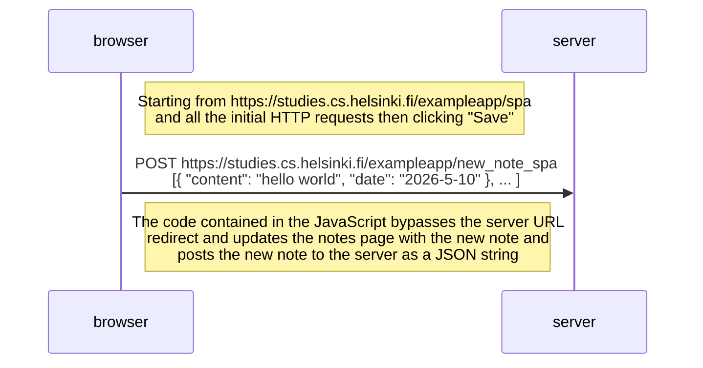

```mermaid
sequenceDiagram
    participant browser
    participant server

    Note right of browser: Starting from https://studies.cs.helsinki.fi/exampleapp/spa <br/>and all the initial HTTP requests then clicking "Save"

    browser->>server: POST https://studies.cs.helsinki.fi/exampleapp/new_note_spa <br/>[{ "content": "hello world", "date": "2026-5-10" }, ... ]
    activate server

    Note right of browser: The code contained in the JavaScript bypasses the server URL <br/>redirect and updates the notes page with the new note and <br/>posts the new note to the server as a JSON string
```
